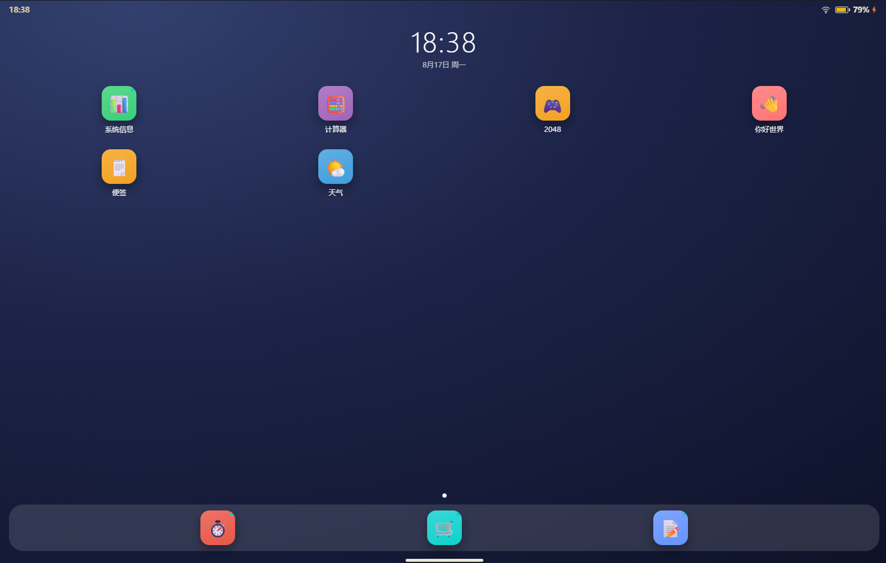

# 🚀 Web Launcher — 轻量级多语言应用部署平台


一个用 Python 标准库写的应用运行时，支持部署 Python / C/C++ / Web 等多种类型的应用，提供应用商店、版本仓库与进程管理：启动 / 端口就绪探测 / 优雅停止 / 安装升级回退 / 自身 OTA。

适用场景：嵌入式主板、工控机、边缘设备、本地开发机——只要能跑 Python，就能用 launcher 管理任意语言写的应用。

## 📌 项目定位

| 维度 | 说明 |
|------|------|
| **是什么** | 一个应用运行时 + 应用商店 + 版本仓库的整套方案 |
| **不是什么** | 不是容器运行时（无 namespace/cgroup 隔离），不是包管理器（不替代 pip/npm） |
| **核心价值** | 用最小依赖（Python 标准库）+ 最小协议（app.json）管理多语言应用的部署、增删、升级 |
| **目标平台** | Windows / Linux / macOS / ARM 嵌入式（树莓派、Jetson 等） |

## ✨ 核心特性

### 1. 进程启动 + 端口就绪探测
- launcher 用 `subprocess.Popen` 拉起应用进程（`.py` 自动前缀 `sys.executable`，其他直接执行）
- 若 `app.json` 声明了 `port`，启动后用 `socket.create_connection` 轮询端口直到监听成功（默认 6s 超时）
- 无 `port` 的进程型应用启动即视为就绪
- 跨平台 Popen kwargs：Windows 隐藏控制台（`CREATE_NO_WINDOW`），POSIX 设新会话以便后续 `killpg`

### 2. 优雅停止 + 进程树清理
- `/api/close?id=<aid>` 触发 `p.terminate()` → 等 2 秒 → 兜底 `taskkill /F /T /PID`（Win）/ `os.killpg`（POSIX）杀整棵进程树
- launcher 退出时 `atexit` 钩子按上述流程顺序停所有子进程，避免 C/C++ 子进程成孤儿
- 不读 `stop_signal` / `stop_timeout`（这两字段当前保留，未生效；见路线图）

### 3. 系统应用 / 用户应用分层 + 自定义分组
- **系统应用**（`apps/system/`）：默认安装、接受更新、不可卸载（受保护分组 `"system"`）
- **用户应用**（`apps/user/`）：可安装 / 卸载
- **自定义分组**：app.json 的 `group` 字段可填任意值（如 `"business"`、`"admin"`），发布与卸载按此分组；缺省时根据 `system` 字段推导为 `"system"` 或 `"user"`

### 4. 仓库索引 + 原子安装
- 远端仓库是一个 HTTP 静态目录：`index.json` + `packages/<id>-<ver>.zip` + `launcher-<ver>.zip`
- `repo_get(path)` 支持 BASIC 认证 + SSL 校验开关
- `atomic_extract_zip`：sha256 校验 → 写 tmp → 解压（防 zip 路径穿越）→ `shutil.move` 原子替换目标目录
- 兼容 3 种 zip 结构：`apps/<group>/<id>/...` / `<id>/...` / 扁平文件列表
- 支持安装最新版本或指定历史版本（供回退）

### 5. 多语言 cmd 解析
- `.py` / `.pyw`：自动前缀 `sys.executable`
- `.exe` / ELF / 任意可执行文件：直接执行
- 当前**不透传** `workdir` / `env`（字段保留，未生效；见路线图）

### 6. Launcher 自更新（双模式 OTA）
- `/api/launcher/update` 触发 → `do_launcher_update` 用 `getattr(sys, "frozen", False)` 区分：
  - **源码模式**：下载 `launcher-<ver>.zip` → 解压覆盖 `launcher.py` / `launcher/` 包 → 合并 `config.json` → reload
  - **编译模式**：下载二进制 → 校验 sha256 → `updater.launch_self_update()` 后台 spawn `updater.bat`（Win）/ `updater.sh`（Linux）→ 主进程退出 → 脚本替换 exe → 自动重启
- 状态栏 ⚙️ 按钮显示版本号，有新版本时红点闪烁

### 7. 用户级布局覆盖（layout.json）
- 状态栏 🗂️ 按钮打开"布局编辑"面板
- 用户可勾选每个应用是否在 Dock / 是否从桌面隐藏
- `layout.json` 覆盖 `app.json` 的 `dock` 默认值；未保存过时用 `app.json` 默认
- POST `/api/layout` 保存后立即 `reload_apps()` 刷新注册表

### 8. 桌面交互（仿移动端）
- **状态栏**：时钟 / 网络 / 电量 / 🗂️ 布局编辑 / ⚙️ 关于按钮（带更新红点）
- **分页桌面**：响应式网格 + 左右滑动 + 分页指示器
- **Dock 栏**：常驻底部，毛玻璃拟态，悬停上浮放大
- **最近任务面板**：底部上滑手势呼出，卡片上滑清除、全部清除、点击切回应用
- **应用商店详情弹窗**：展示 Changelog / 历史版本列表 / 一键回退
- **关于模态**：本地 + 远端版本对比、Changelog、立即检查更新
- **手势**：水平滑动切屏、垂直上滑开最近任务、底部 Home 条点击关闭面板

## 🏗 架构

```
┌─────────────────────────────────────────────────────┐
│  Launcher (Python stdlib, http.server, port 8000)  │
│  ─────────────────────────────────────────────────  │
│  launcher.py            ← 薄壳入口                  │
│  launcher/              ← 9 个功能模块              │
│    ├ config.py          ← 配置加载/路径常量         │
│    ├ app_registry.py    ← 应用扫描/注册表           │
│    ├ process_manager.py ← spawn/port_probe/close   │
│    ├ app_operations.py  ← install/uninstall/回退    │
│    ├ repo.py            ← 仓库索引/HTTP 客户端      │
│    ├ http_handler.py    ← 路由                      │
│    ├ frontend.py        ← 首页 HTML 渲染             │
│    ├ layout.py          ← 用户布局覆盖（layout.json）│
│    └ updater.py         ← 二进制 OTA 替换脚本       │
│  launcher_updater.py    ← 独立更新工具（外部触发） │
│  publish.py             ← 发布到仓库                │
│  ─────────────────────────────────────────────────  │
│  • 桌面 UI（毛玻璃 + 分页 + Dock + 最近任务面板）  │
│  • 应用生命周期（spawn / port_probe / graceful stop）│
│  • 安装/卸载/版本回退 + 受保护分组（system 不可卸载）│
│  • 应用商店详情弹窗 + 历史版本回退                  │
│  • 用户布局覆盖（layout.json：dock/hidden）        │
│  • 自更新（开发态 zip 覆盖 / 编译态 bat/sh 替换）  │
└─────────────┬───────────────────────────┬──────────┘
              │ subprocess.Popen          │ HTTP/HTTPS
              ▼                           ▼
┌─────────────────────────┐    ┌──────────────────────────┐
│  Apps (任意语言)         │    │  Repo (HTTP 静态目录)    │
│  ─────────────────────  │    │  ──────────────────────  │
│  apps/system/           │    │  index.json              │
│    store/  todo/  clock/│    │  packages/<id>-<ver>.zip │
│    sysinfo/ settings/   │    │  launcher-<ver>.zip      │
│  apps/user/             │    └──────────────────────────┘
│    hello/  notes/       │              ▲
│    weather/ game2048/   │              │ scp
│    proc-demo/ file-demo/│ ─────────────┘
│    system-monitor/      │  publish.py --all / --launcher
│    cpp-hello/ (C++)     │
└─────────────────────────┘
```

## 🚀 快速开始

```bash
# 1. 启动 launcher
python launcher.py

# 2. 浏览器打开（一般会自动打开）
# http://127.0.0.1:8000/

# 3. 点桌面图标打开任意应用，或点 🛒 应用商店安装新应用
```

需要 Python ≥ 3.8，无第三方依赖（标准库足够）。

## 📋 app.json Schema

应用清单文件，放在 `apps/system/<id>/app.json` 或 `apps/user/<id>/app.json`。

### 当前生效字段

| 字段 | 类型 | 必填 | 默认 | 说明 |
|------|------|------|------|------|
| `id` | string | ✅ | — | 应用唯一标识（与目录名一致） |
| `name` | string | ✅ | — | 显示名称 |
| `version` | string | ✅ | — | 语义化版本号（`1.0.0`） |
| `cmd` | string[] | ❌ | — | 启动命令（`.py` 自动加 python 前缀） |
| `port` | int | ❌ | — | HTTP/TCP 端口（用于端口就绪探测与 iframe URL） |
| `icon` | string | ❌ | 📦 | emoji 图标 |
| `color` | string | ❌ | #999 | 主题色（CSS） |
| `changelog` | string | ❌ | — | 版本说明 |
| `released` | string | ❌ | — | 发布时间（ISO 8601） |
| `dock` | bool | ❌ | false | 是否常驻底部 Dock（出厂默认；用户可用 layout.json 覆盖） |
| `system` | bool | ❌ | false | 是否系统应用（一般不手填，按目录自动推导） |
| `group` | string | ❌ | 推导 | 自定义分组（如 `"business"`、`"admin"`）；缺省时按 `system` 推导 |
| `requires` | object | ❌ | `{}` | 依赖声明（**当前未校验，仅作文档**，见路线图） |

### 字段当前行为说明

> ⚠️ 下列字段在 schema 文档中曾出现过，但**当前代码不读取 / 不生效**，路线图里已列为待实现：
>
> | 字段 | 当前行为 |
> |------|----------|
> | `ready_check` | **不读取**；launcher 只看 `port` 字段做 TCP 端口探测 |
> | `restart_policy` | **不读取**；进程崩溃后不自动重启 |
> | `stop_signal` | **不读取**；`close_app` 直接 `p.terminate()` |
> | `stop_timeout` | **不读取**；硬编码 2 秒后强 kill |
> | `workdir` | **不读取**；`Popen` 未传 `cwd` |
> | `env` | **不读取**；`Popen` 未传 `env`（且 `env` 不进 index.json，避免密钥泄漏） |
>
> 写在 app.json 里不会报错，但也不会生效。这些能力在路线图中。

### 最小可用清单

```json
{
  "id": "my-app",
  "name": "我的应用",
  "version": "1.0.0",
  "cmd": ["apps/user/my-app/app.py"],
  "port": 8120
}
```

## 🛡 应用类型对比

| 属性 | 系统应用 | 用户应用 |
|------|---------|---------|
| 目录 | `apps/system/` | `apps/user/` 或 `apps/<自定义 group>/` |
| 默认安装 | ✅ | ❌（需手动装） |
| 接受更新 | ✅ | ✅ |
| 允许卸载 | ❌ | ✅ |
| 桌面图标标记 | 右上角青色小圆点 | 无 |
| 用途 | 商店、待办、番茄钟、系统信息 | 业务应用、demo |

## 🔌 API 列表

| 路径 | 方法 | 说明 |
|------|------|------|
| `/api/apps` | GET | 列出全部应用 + 运行状态（含 `running: bool`） |
| `/api/layout` | GET | 读取用户布局（dock / hidden；未保存过时 dock=null） |
| `/api/layout` | POST | 保存布局配置（原子写 layout.json + reload_apps） |
| `/api/repo` | GET | 拉取远端仓库索引（含可升级标记 + 历史 versions） |
| `/api/repo/config` | GET | 读取仓库 URL / BASIC 认证 / SSL 配置 |
| `/api/repo/config` | POST | 保存仓库配置（原子写 config.json + reload） |
| `/api/install?id=<aid>` | GET | 安装 / 升级应用到最新版本 |
| `/api/install-version?id=<aid>&version=<v>` | GET | 安装指定历史版本（供回退） |
| `/api/uninstall?id=<aid>` | GET | 卸载用户应用（受保护分组 system 拒绝） |
| `/api/open?id=<aid>` | GET | 启动应用进程 + 返回 iframe URL |
| `/api/close?id=<aid>` | GET | 关闭应用进程树（terminate → 2s → 强 kill） |
| `/api/launcher/version` | GET | launcher 本地 + 远端版本对比（是否可升级） |
| `/api/launcher/update` | GET | 触发 launcher 自更新流程 |

### `running` 字段

`/api/apps` 返回的每个应用含 `running: bool`（true = 进程在运行，false = 未启动或已退出）。当前无 `status` 多状态字段（如 starting/restarting/crashed），见路线图。

## 📦 发布流程

### 发布应用

```bash
# 列出所有可发布的应用
python publish.py --list

# 发布单个应用
python publish.py apps/user/hello

# 一键发布所有应用
python publish.py --all

# 只发系统应用 / 用户应用
python publish.py --system
python publish.py --user

# 发布指定分组
python publish.py --group business

# 只打包不上传（测试）
python publish.py apps/user/hello --dry-run
```

### 发布 Launcher 自身更新

```bash
# 1. 修改 config.json 的 launcher.version（如 1.0.3）
# 2. 发布
python publish.py --launcher --changelog "修复 X，新增 Y"
```

客户端在状态栏右上角 ⚙️ `v1.0.2` 胶囊可见，有新版本时红点闪烁，点击「立即更新」即可 OTA。

### 独立更新工具（外部触发，可选）

当 launcher 进程已退出或无法通过 UI 触发更新时，可用 `launcher_updater.py` 独立检查 / 更新：

```bash
# 检查版本
python launcher_updater.py check --base .

# 更新（自动通知 launcher 优雅退出 → 替换 → 重启）
python launcher_updater.py update --base . --stop --restart

# 强制更新（不通知，强杀占用端口的进程，慎用）
python launcher_updater.py update --base . --force --stop --restart
```

> 注：当前 `launcher_updater.py` 仅完整支持源码模式更新；编译模式（PyInstaller）的 `update_binary()` 是 TODO，见路线图。

### 仓库结构（远端）

```
/var/www/repo/
├── index.json              # 应用清单 + launcher 元信息
└── packages/
    ├── hello-1.0.0.zip
    ├── weather-1.0.0.zip
    └── launcher-1.0.0.zip   # launcher 自更新包
```

## 🎯 内置应用

### 系统应用（`apps/system/`）

| 应用 | 端口 | 说明 |
|------|------|------|
| 🛒 应用商店 store | 8100 | 安装 / 升级 / 卸载用户应用，详情弹窗 + 历史版本回退 |
| 📝 待办清单 todo | 8101 | 最简待办 demo |
| ⏱️ 番茄钟 clock | 8102 | 计时器 demo |
| 📊 系统信息 sysinfo | 8103 | CPU / 内存 / 磁盘 + 版本信息 + 已安装应用列表 |
| ⚙️ 设置 settings | 8104 | 仓库地址 / BASIC 认证 / SSL 校验配置 |

### 用户应用 demo（`apps/user/`）

#### Web 类 demo（端口 8110-8114）

| 应用 | 端口 | 演示场景 |
|------|------|----------|
| 👋 hello | 8110 | 最简交互（计数器 + 时钟） |
| 🗒️ notes | 8112 | `localStorage` 持久化 |
| 🌤️ weather | 8113 | 多视图切换 + mock 数据 + JSON API |
| 🎮 game2048 | 8114 | 完整游戏（矩阵算法 + 键盘/触摸） |

#### 后台进程 demo（无端口）

| 应用 | 演示场景 |
|------|----------|
| ⚙️ proc-demo | 进程型应用：无端口，启动后立即视为就绪；展示无 HTTP 服务的应用如何接入 |
| 📄 file-demo | 占位 stub：无 cmd，启动即视为就绪；演示最简清单 |

#### 实时与原生 demo（端口 8130-8140）

| 应用 | 端口 | 演示场景 |
|------|------|----------|
| 📈 system-monitor | 8130 | 实时 CPU / 内存折线图 + TOP 进程 + 网络流量（psutil 优先，无则原生 wmic/proc） |
| 🦾 cpp-hello | 8140 | **C++ 应用部署模板**：原生 socket HTTP server，跨平台编译产物 + `run.py` 启动包装 + 子进程树清理 |

> `cpp-hello` 是 C/C++ 应用的接入模板。`socket / 串口 / ROS2` 等原生程序可参照它：源码 + `build.{bat,sh}` + `run.py` 包装 + `app.json`。详见 [apps/README.md#部署-cc-应用](apps/README.md#🦾-部署-cc-应用)。

## 🔧 配置

`config.json`：

```json
{
  "launcher": {
    "host": "127.0.0.1",
    "port": 8000,
    "title": "我的 Launcher",
    "version": "1.0.0",
    "released": "2026-08-18T16:00:00",
    "changelog": "..."
  },
  "repo": {
    "url": "https://your-repo.example.com",
    "auth": null,
    "verify_ssl": false
  },
  "publish": {
    "server": "ubuntu@1.15.30.237",
    "remote_path": "/var/www/repo",
    "packages_dir": "packages"
  },
  "system_apps": ["store", "todo", "clock", "settings", "sysinfo"],
  "ports": {
    "store": 8100,
    "todo": 8101,
    "clock": 8102,
    "sysinfo": 8103,
    "settings": 8104
  }
}
```

`publish` / `system_apps` 字段仅供本地开发用，**不进 launcher 自更新包**（脱敏处理）。

## 🌐 部署到嵌入式主板

### 1. Python 环境
- 推荐 Python 3.10+（兼容性最好）
- 树莓派 / Jetson：用系统自带 `python3` 即可
- 极小设备：用 `python3-minimal` + 手动补 `pip`

### 2. 跨平台注意事项
- **ARM 架构**：launcher 本身是纯 Python，无架构依赖；C/C++ 应用需对应架构编译
- **Windows CE / RT**：不支持（依赖 `subprocess.CREATE_NO_WINDOW`）
- **Linux musl**：`signal.SIGTERM` 等 POSIX 信号可用，`signal.CTRL_BREAK_EVENT` 不可用
- **C/C++ 应用部署**：参照 [cpp-hello 模板](apps/user/cpp-hello/)，建议静态链接（`-static`）避免运行时缺 DLL；x86 / ARM 分别出 zip

### 3. 应用预装
- 把 `apps/system/` 全部预装到主板（出厂默认）
- `apps/user/` 由用户后续通过应用商店安装
- 仓库 URL 配置成自己的镜像（HTTPS + basic auth 可选）

## 📂 目录结构

```
web-launcher/
├── launcher.py              # 薄壳入口（import launcher.__main__.main）
├── launcher_updater.py      # 独立更新工具（外部触发 check/update）
├── publish.py                # 发布工具（应用 + launcher 自更新）
├── config.json              # 配置（host/port/repo/ports/system_apps）
├── layout.json              # 用户布局覆盖（dock/hidden；首次保存后生成）
├── README.md                # 本文档
├── launcher/                # 实现包（9 个功能模块）
│   ├── __init__.py
│   ├── __main__.py          # 主入口（HTTP server + atexit 回收）
│   ├── config.py            # 配置加载 / 路径常量
│   ├── app_registry.py      # 应用扫描 / 注册表
│   ├── process_manager.py   # spawn / port_probe / close / terminate_all
│   ├── app_operations.py    # install / uninstall / 版本回退 / launcher OTA
│   ├── repo.py              # 仓库索引 / HTTP 客户端 / 原子解压
│   ├── http_handler.py      # 路由
│   ├── frontend.py          # 首页 HTML 渲染
│   ├── layout.py            # 用户布局覆盖（layout.json 读写 + apply_layout）
│   ├── updater.py           # 二进制 OTA 替换脚本（Win .bat / Linux .sh）
│   └── templates/
│       └── home.html         # 桌面 UI（毛玻璃 + 分页 + Dock + 最近任务）
├── apps/
│   ├── README.md            # 应用开发指南
│   ├── system/              # 系统应用（默认安装、不可卸载）
│   │   ├── store/           # 🛒 应用商店
│   │   ├── todo/            # 📝 待办清单
│   │   ├── clock/           # ⏱️ 番茄钟
│   │   ├── sysinfo/         # 📊 系统信息
│   │   └── settings/        # ⚙️ 仓库配置
│   └── user/                # 用户应用（可增删）
│       ├── hello/           # 👋 最简 demo
│       ├── notes/           # 🗒️ 便签
│       ├── weather/         # 🌤️ 天气
│       ├── game2048/        # 🎮 2048 小游戏
│       ├── proc-demo/       # ⚙️ 后台进程 demo
│       ├── file-demo/       # 📄 占位 stub demo
│       ├── system-monitor/  # 📈 实时监控
│       └── cpp-hello/       # 🦾 C++ 应用模板
└── doc/                     # 部署文档
    └── 服务器端-部署.md
```

## 🔒 安全注意事项

- `env` 字段不进 index.json（防密钥泄漏到仓库）；当前 `env` 字段虽未生效，但 publish.py 仍按此约定脱敏
- `/api/apps` 不暴露 env 内容
- 仓库 URL 若包含敏感信息，建议用 HTTPS + basic auth（`config.json.repo.auth`）
- launcher 默认监听 `127.0.0.1`，不对外暴露；如需远程访问请加反向代理 + 鉴权

## 🛣 路线图

### 已完成
- [x] 进程启动 + TCP 端口就绪探测
- [x] 优雅停止（terminate → 2s → 强 kill 进程树）+ atexit 回收
- [x] 安装 / 卸载 / 历史版本回退 + 原子解压 + sha256 校验
- [x] 仓库索引 + BASIC 认证 + SSL 开关
- [x] system/user 两级目录 + 受保护分组（system 不可卸载）
- [x] 自定义 group 字段（business / admin 等）
- [x] launcher 自更新（源码 zip 覆盖 + 编译态 OTA 替换脚本）
- [x] 桌面 UI（毛玻璃 + 分页 + Dock + 最近任务 + 关于 + 商店详情弹窗）
- [x] 用户级布局覆盖（layout.json：dock / hidden）
- [x] cpp-hello demo（C++ 应用部署模板）
- [x] 代码模块化（launcher/ 包 9 个功能模块）

### 待实现
- [ ] **ready_check 5 种就绪判定**（http/tcp/process/file/none）—— 当前只做 TCP 端口探测
- [ ] **restart_policy 崩溃重启**（always/failure/never + max_retries + delay）—— 当前无 watcher 线程
- [ ] **requires 依赖校验**（python/packages/system）—— 当前 do_install 不校验
- [ ] **stop_signal / stop_timeout 可配**—— 当前硬编码 terminate + 2s
- [ ] **workdir / env 透传**—— 当前 Popen 不传
- [ ] **status 多状态字段**（starting/restarting/crashed/stopped）—— 当前只有 running: bool
- [ ] **launcher_updater.py 编译模式**（update_binary）—— 当前仅源码模式完整
- [ ] **publish.py --binary** 多平台打包
- [ ] 应用间 IPC 总线（发现 + 调用）
- [ ] 应用资源限制（CPU / 内存配额）
- [ ] 日志收集与轮转
- [ ] serial-echo demo（pyserial 串口应用）
- [ ] ros2-listener demo（ROS2 节点接入）

## 📜 License

MIT
