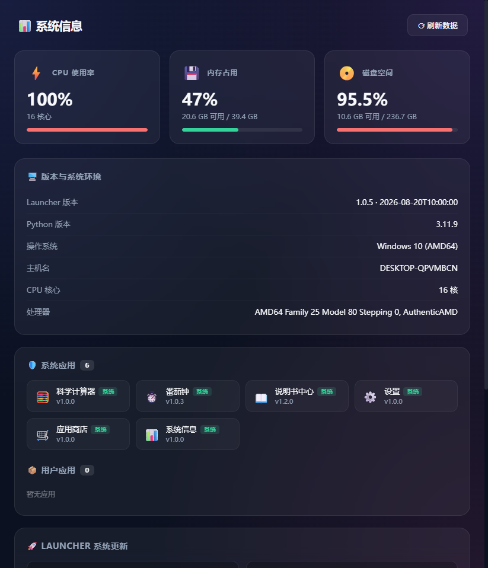

# 🚀 Web Launcher — 轻量级多语言应用部署平台


一个用 Python 标准库写的应用运行时，支持部署 Python / C/C++ / Web 等多种类型的应用，提供应用商店、版本仓库与进程管理：启动 / 端口就绪探测 / 优雅停止 / 安装升级回退 / 自身 OTA。

适用场景：嵌入式主板、工控机、边缘设备、本地开发机——只要能跑 Python，就能用 launcher 管理任意语言写的应用。

## 🔗 相关仓库

- [Gitee：web-launcher](https://gitee.com/jun626/web-launcher)
- [GitHub：web-launcher](https://github.com/Jun1172/web-launcher)
- [GitHub：web-launcher-apps（应用仓库）](https://github.com/Jun1172/web-launcher-apps)

`web-launcher` 提供运行时、桌面界面、应用商店和发布工具；`web-launcher-apps` 提供可由本项目加载和发布的公开游戏、通用工具、ROS2 工具及示例应用。

## 🔧 系统应用演示



## 📌 项目定位

| 维度 | 说明 |
|------|------|
| **是什么** | 一个应用运行时 + 应用商店 + 版本仓库的整套方案 |
| **不是什么** | 不是容器运行时（无 namespace/cgroup 隔离），不是包管理器（不替代 pip/npm） |
| **核心价值** | 用最小依赖（Python 标准库）+ 最小协议（app.json）管理多语言应用的部署、增删、升级 |
| **目标平台** | Windows / Linux / macOS / ARM 嵌入式（树莓派、Jetson 等） |

## ✨ 核心特性

### 1. 进程启动 + 端口就绪探测
- launcher 用 `subprocess.Popen` 拉起应用进程（`.py` 自动前缀 `sys.executable`，其他直接执行）
- 若 `app.json` 声明了 `port`，启动后用 `socket.create_connection` 轮询端口直到监听成功（默认 6s 超时）
- 无 `port` 的进程型应用启动即视为就绪
- 跨平台 Popen kwargs：Windows 隐藏控制台（`CREATE_NO_WINDOW`），POSIX 设新会话以便后续 `killpg`

### 2. 优雅停止 + 进程树清理
- `/api/close?id=<aid>` 触发 `p.terminate()` → 等 2 秒 → 兜底 `taskkill /F /T /PID`（Win）/ `os.killpg`（POSIX）杀整棵进程树
- launcher 退出时 `atexit` 钩子按上述流程顺序停所有子进程，避免 C/C++ 子进程成孤儿

### 3. 系统应用 / 用户应用分层 + 自定义分组
- **系统应用**（`apps/system/`）：默认安装、接受更新、不可卸载（受保护分组 `"system"`）
- **用户应用**（`apps/user/`）：可安装 / 卸载
- **自定义分组**：app.json 的 `group` 字段可填任意值（如 `"business"`、`"admin"`），发布与卸载按此分组；缺省时推导为 `"user"`

### 4. 仓库索引 + 原子安装
- 远端仓库是一个 HTTP 静态目录：`index.json` + `packages/<id>-<ver>.zip` + `launcher-<ver>.zip`
- `repo_get(path)` 支持 BASIC 认证 + SSL 校验开关
- `atomic_extract_zip`（在 `launcher/zipio.py`）：sha256 校验 → 写 tmp → 解压（防 zip 路径穿越）→ `shutil.move` 原子替换目标目录
- 兼容 3 种 zip 结构：`apps/<group>/<id>/...` / `<id>/...` / 扁平文件列表
- 安装 / 升级到最新版本

### 5. 多语言 cmd 解析
- `.py` / `.pyw`：自动前缀 `sys.executable`
- `.exe` / ELF / 任意可执行文件：直接执行
- 当前**不透传** `env`

### 6. Launcher 自更新（双模式 OTA）
- `/api/launcher/update` 触发 → `do_launcher_update` 用 `getattr(sys, "frozen", False)` 区分：
  - **源码模式**：下载 `launcher-<ver>.zip` → 解压覆盖 `launcher.py` / `launcher/` 包 → 合并 `config.json` → reload
  - **编译模式**：下载二进制 → 校验 sha256 → `updater.launch_self_update()` 后台 spawn `updater.bat`（Win）/ `updater.sh`（Linux）→ 主进程退出 → 脚本替换 exe → 自动重启
- `GET /api/launcher/version` 返回本地 + 远端版本对比（`upgradable`），`GET /api/launcher/update` 触发 OTA

### 7. 用户级布局覆盖（layout.json）
- 状态栏 🗂️ 按钮打开"布局编辑"面板
- 用户可勾选每个应用是否在 Dock / 是否从桌面隐藏
- `layout.json` 覆盖 `app.json` 的 `dock` 默认值；未保存过时用 `app.json` 默认
- POST `/api/layout` 保存后立即 `reload_apps()` 刷新注册表

### 8. 桌面交互（仿移动端）
- **状态栏**：时钟 / 网络 / 电量 / 🗂️ 布局编辑 / 窗口控制按钮（最小化 / 最大化 / 关闭，桌面模式）
- **分页桌面**：响应式网格 + 左右滑动 + 分页指示器
- **Dock 栏**：常驻底部，毛玻璃拟态，悬停上浮放大
- **最近任务面板**：底部上滑手势呼出，卡片上滑清除、全部清除、点击切回应用
- **应用商店详情弹窗**：展示 Changelog / 版本信息
- **手势**：水平滑动切屏、垂直上滑开最近任务、底部 Home 条点击关闭面板

## 🏗 架构

```
┌─────────────────────────────────────────────────────┐
│  Launcher (Python stdlib, http.server, port 8000)  │
│  ─────────────────────────────────────────────────  │
│  launcher.py            ← 薄壳入口                  │
│  launcher/              ← 13 个功能模块             │
│    ├ config.py          ← 配置加载/路径常量/工具函数 │
│    ├ app_registry.py    ← 应用扫描/注册表/group推导  │
│    ├ process_manager.py ← spawn/port_probe/close   │
│    ├ app_operations.py  ← install/uninstall         │
│    ├ repo.py            ← 仓库索引/HTTP 客户端      │
│    ├ zipio.py           ← 原子解压工具             │
│    ├ http_handler.py    ← 路由                      │
│    ├ frontend.py        ← 首页 HTML 渲染             │
│    ├ layout.py          ← 用户布局覆盖（layout.json）│
│    ├ updater.py         ← 二进制 OTA 替换脚本       │
│    ├ window_win32.py    ← Win32 无边框窗口/缩放控制 │
│    ├ __main__.py        ← 进程入口（HTTP+pywebview）│
│    └ templates/         ← 布局/主题模板（4+3）      │
│  publish.py             ← 发布到仓库                │
│  ─────────────────────────────────────────────────  │
│  • 桌面 UI（毛玻璃 + 分页 + Dock + 最近任务面板）  │
│  • 应用生命周期（spawn / port_probe / graceful stop）│
│  • 安装/卸载 + 受保护分组（system 不可卸载）        │
│  • 应用商店详情弹窗                                │
│  • 用户布局覆盖（layout.json：dock/hidden）        │
│  • 自更新（开发态 zip 覆盖 / 编译态 bat/sh 替换）  │
└─────────────┬───────────────────────────┬──────────┘
              │ subprocess.Popen          │ HTTP/HTTPS
              ▼                           ▼
┌─────────────────────────┐    ┌──────────────────────────┐
│  Apps (任意语言)         │    │  Repo (HTTP 静态目录)    │
│  ─────────────────────  │    │  ──────────────────────  │
│  apps/system/           │    │  index.json              │
│    store/  todo/  clock/│    │  packages/<id>-<ver>.zip │
│    sysinfo/ settings/   │    │  launcher-<ver>.zip      │
│  apps/user/             │    └──────────────────────────┘
│  apps/etws/  apps/ros/  │              ▲
│  apps/game/ (外部仓库)  │ ─────────────┘
│  app.json 递归扫描      │  publish.py --all / --launcher
└─────────────────────────┘
```

## 🚀 快速开始

```bash
# 1. 启动 launcher
python launcher.py

# 2. 浏览器打开（一般会自动打开）
# http://127.0.0.1:8000/

# 3. 点桌面图标打开任意应用，或点 🛒 应用商店安装新应用

需要 Python ≥ 3.8，无第三方依赖（标准库足够）。

## 📋 app.json Schema

应用清单文件，放在 `apps/system/<id>/app.json` 或 `apps/user/<id>/app.json`。

| 字段 | 类型 | 必填 | 默认 | 说明 |
|------|------|------|------|------|
| `id` | string | ✅ | — | 应用唯一标识（与目录名一致） |
| `name` | string | ✅ | — | 显示名称 |
| `version` | string | ✅ | — | 语义化版本号（`1.0.0`） |
| `cmd` | string[] | ❌ | — | 启动命令；`.py`/`.pyw` 自动前缀 `sys.executable`，其他直接执行 |
| `port` | int | ❌ | — | 建议端口（被占时 launcher 自动分配随机端口）；用于 TCP 就绪探测 + iframe URL |
| `icon` | string | ❌ | 📦 | emoji 图标 |
| `color` | string | ❌ | #999 | 主题色（CSS） |
| `group` | string | ❌ | `"user"` | 分组来源；`"system"` 受保护不可卸载 |
| `dock` | bool | ❌ | false | 是否常驻底部 Dock（用户可用 layout.json 覆盖） |
| `changelog` | string | ❌ | — | 版本说明 |
| `released` | string | ❌ | — | 发布时间（ISO 8601） |

`cpp-hello` 是 C/C++ 应用的接入模板。`socket`、串口、ROS2 等原生程序可参照它：源码 + `build.{bat,sh}` + `run.py` 包装 + `app.json`。
### 最小可用清单

```json
{
  "id": "my-app",
  "name": "我的应用",
  "version": "1.0.0",
  "cmd": ["apps/user/my-app/app.py"],
  "port": 8120
}
```

## 🛡 应用类型对比

| 属性 | 系统应用 | 用户应用 |
|------|---------|---------|
| 目录 | `apps/system/` | `apps/user/` 或 `apps/<自定义 group>/` |
| 默认安装 | ✅ | ❌（需手动装） |
| 接受更新 | ✅ | ✅ |
| 允许卸载 | ❌ | ✅ |
| 桌面图标标记 | 右上角青色小圆点 | 无 |
| 用途 | 商店、待办、番茄钟、系统信息 | 业务应用、demo |

## 🔌 API 列表

| 路径 | 方法 | 说明 |
|------|------|------|
| `/api/apps` | GET | 列出全部应用 + 运行状态（含 `running: bool` 与 `actual_port`） |
| `/api/layout` | GET | 读取用户布局（dock / hidden；未保存过时 dock=null） |
| `/api/layout` | POST | 保存布局配置（原子写 layout.json + reload_apps） |
| `/api/repo` | GET | 拉取远端仓库索引（含可升级标记） |
| `/api/repo/config` | GET | 读取仓库 URL / BASIC 认证 / SSL 配置 |
| `/api/repo/config` | POST | 保存仓库配置（原子写 config.json + reload） |
| `/api/install?id=<aid>` | GET | 安装 / 升级应用到最新版本 |
| `/api/uninstall?id=<aid>` | GET | 卸载用户应用（受保护分组 system 拒绝） |
| `/api/open?id=<aid>` | GET | 启动应用进程 + 返回 iframe URL |
| `/api/close?id=<aid>` | GET | 关闭应用进程树（terminate → 2s → 强 kill） |
| `/api/launcher/version` | GET | launcher 本地 + 远端版本对比（是否可升级） |
| `/api/launcher/update` | GET | 触发 launcher 自更新流程 |

### `running` 字段

`/api/apps` 返回的每个应用含 `running: bool`（true = 进程在运行，false = 未启动或已退出）。当前无 `status` 多状态字段（如 starting/restarting/crashed），见路线图。

## 📦 发布流程

### 发布应用

```bash
# 列出所有可发布的应用
python publish.py --list

# 发布单个应用
python publish.py apps/user/hello

# 一键发布所有应用
python publish.py --all

# 只发系统应用 / 用户应用
python publish.py --system
python publish.py --user

# 发布指定分组
python publish.py --group business

# 只打包不上传（测试）
python publish.py apps/user/hello --dry-run
```

### 发布 Launcher 自身更新

```bash
# 1. 修改 config.json 的 launcher.version（如 1.0.3）
# 2. 发布
python publish.py --launcher --changelog "修复 X，新增 Y"
```

通过 `GET /api/launcher/version` 查看本地/远端版本对比，`GET /api/launcher/update` 触发 OTA 更新。

> 注：外部独立更新工具（`launcher_updater.py`）尚未实现，当前仅支持通过 UI 触发 OTA；见路线图。

### 仓库结构（远端）

```
/var/www/repo/
├── index.json              # 应用清单 + launcher 元信息
└── packages/
    ├── hello-1.0.0.zip
    ├── weather-1.0.0.zip
    └── launcher-1.0.0.zip   # launcher 自更新包
```

## 🎯 内置应用

当前仓库通过递归扫描 `apps/**/app.json` 注册应用。应用的发布分组由 `app.json` 中的 `group` 字段决定，目录名只是物理组织方式；因此 `system`、`user` 和自定义分组可以并存。

### 系统应用（`apps/system/`）

| 应用 | 端口 | 说明 |
|------|------|------|
| 🧮 calculator | 8140 | 科学计算器 |
| 🛒 应用商店 store | 8100 | 安装 / 升级 / 卸载用户应用，详情弹窗 |
| ⏱️ 番茄钟 clock | 8102 | 计时器 demo |
| 📊 系统信息 sysinfo | 8103 | CPU / 内存 / 磁盘 + 版本信息 + 已安装应用列表 |
| ⚙️ 设置 settings | 8104 | 仓库地址 / BASIC 认证 / SSL 校验配置 |
| 📖 md-viewer | 8154 | 本地 Markdown 文档查看器 |

### 用户应用 demo（`apps/user/`）

| 应用 | 端口 | 演示场景 |
|------|------|----------|
| 🎮 game2048 | 8121 | 2048 小游戏 |
| 👋 hello | 8122 | 最简交互 demo |
| 🌤️ weather | 8123 | 天气示例 |
| 🦾 cpp-hello | 8124 | C++ 应用部署模板 |
| 📈 system-monitor | 8125 | 系统资源实时监控 |
| 📋 log-viewer | 8151 | 日志查看示例 |
| 🕒 cron-ui | 8152 | 可视化定时任务 |
| 🕰️ nixie-clock | 8168 | 拟真数码管时钟 |
| 📝 todo | 8101 | 待办清单示例 |

### etws / ros 分组（业务工具）

| 分组 | 应用 | 端口 |
|------|------|------|
| etws | ad-analysis（AD 数据解析） | 8116 |
| etws | mqtt-monitor（状态监测） | 8150 |
| etws | radar-viewer（雷达数据） | 8160 |
| etws | channel-analyse（通道分析） | 8165 |
| ros | ros2-monitor（ROS2 监控） | 8201 |
| ros | ros2-topic-inspector（话题） | 8203 |
| ros | ros2-service（服务） | 8204 |
| ros | ros2-param（参数） | 8205 |
| ros | ros2-action（动作） | 8206 |
| ros | ros2-graph（关系图） | 8207 |
| ros | ros2-type-studio（类型/波形） | 8209 |

## 🌐 部署到嵌入式主板

### 1. Python 环境
- 推荐 Python 3.10+（兼容性最好）
- 树莓派 / Jetson：用系统自带 `python3` 即可
- 极小设备：用 `python3-minimal` + 手动补 `pip`

### 2. 跨平台注意事项
- **ARM 架构**：launcher 本身是纯 Python，无架构依赖；C/C++ 应用需对应架构编译
- **Windows CE / RT**：不支持（依赖 `subprocess.CREATE_NO_WINDOW`）
- **Linux musl**：`signal.SIGTERM` 等 POSIX 信号可用，`signal.CTRL_BREAK_EVENT` 不可用
- **C/C++ 应用部署**：参照 [cpp-hello 模板](apps/user/cpp-hello/)，建议静态链接（`-static`）避免运行时缺 DLL；x86 / ARM 分别出 zip
- **局域网/远程访问**：把 `config.json` 的 `launcher.host` 改为 `0.0.0.0`。iframe 应用地址按浏览器请求的 `Host` 头自动生成（用哪个 IP 访问就返回哪个 IP）；子应用监听地址通过继承的环境变量 `APP_HOST` 跟随 launcher 绑定，无需逐个修改应用。无 GPU 的嵌入式板卡（如 RV1103）装不了 pywebview 时会自动回退纯 HTTP 模式，界面由任意设备浏览器访问板子 IP 打开

### 3. 应用预装
- 把 `apps/system/` 全部预装到主板（出厂默认）
- `apps/user/` 由用户后续通过应用商店安装
- 仓库 URL 配置成自己的镜像（HTTPS + basic auth 可选）

## 🔒 安全注意事项

- `env` 字段不进 index.json（防密钥泄漏到仓库）；当前 `env` 字段虽未生效，但 publish.py 仍按此约定脱敏
- `/api/apps` 不暴露 env 内容
- 仓库 URL 若包含敏感信息，建议用 HTTPS + basic auth（`config.json.repo.auth`）
- launcher 默认监听 `127.0.0.1`，不对外暴露；如需远程访问请加反向代理 + 鉴权

## 🛣 路线图

### 已完成
- [x] 进程启动 + TCP 端口就绪探测
- [x] 优雅停止（terminate → 2s → 强 kill 进程树）+ atexit 回收
- [x] 安装 / 卸载 + 原子解压 + sha256 校验
- [x] 仓库索引 + BASIC 认证 + SSL 开关
- [x] system/user 两级目录 + 受保护分组（system 不可卸载）
- [x] 自定义 group 字段（business / admin 等）
- [x] launcher 自更新（源码 zip 覆盖 + 编译态 OTA 替换脚本）
- [x] 桌面 UI（毛玻璃 + 分页 + Dock + 最近任务 + 关于 + 商店详情弹窗）
- [x] 用户级布局覆盖（layout.json：dock / hidden）
- [x] cpp-hello demo（C++ 应用部署模板）
- [x] 代码模块化（launcher/ 包 13 个功能模块）

### 待实现
- [ ] **env 透传**—— 当前 Popen 不传
- [ ] **status 多状态字段**（starting/restarting/crashed/stopped）—— 当前只有 running: bool
- [ ] **独立更新工具 launcher_updater.py**（外部触发的 check/update，当前未实现）
- [ ] **publish.py --binary** 多平台打包
- [ ] 应用间 IPC 总线（发现 + 调用）
- [ ] 应用资源限制（CPU / 内存配额）
- [ ] 日志收集与轮转
- [ ] serial-echo demo（pyserial 串口应用）
- [ ] ros2-listener demo（ROS2 节点接入）

## 📜 License

MIT
