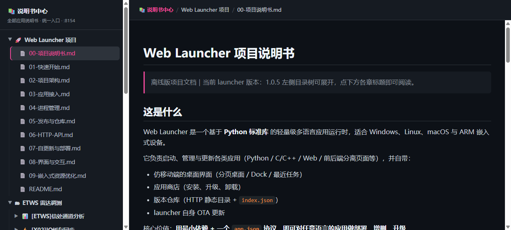

# 📚 说明书中心（md-viewer）



全部应用说明书的统一入口：自动聚合 Launcher 项目文档与每个应用的文档，集中浏览、免维护。

## 收录规则（自动，无需登记）

- 应用有 `docs/` 目录 → 整目录递归收录（推荐方式，图片等资源按相对路径引用）

- 应用没有 `docs/` → 收录应用根目录的 `README.md`

- 两者都没有 → 该应用不出现在目录树

- 另收录 Launcher 项目文档（根目录 README / 部署资料等）

- `.md` 走内置渲染器；`.html`/`.htm` 走 iframe 原样加载（保留原排版，相对路径图片经 `/raw/` 路由解析，无需改写文档内容）

## 功能

- 目录树按 分组 → 应用 → 文档 三级组织，应用带各自 app.json 的图标

- Markdown 渲染：标题 / 列表 / 代码块 / 表格 / 链接 / 图片 / 加粗斜体；文档内相对链接可点击跳转

- HTML 说明书 iframe 加载，自适应撑满阅读区

- 面包屑导航，深色主题，离线运行（无外部 CDN）

## 应用如何挂自己的说明书

```
apps/<group>/<myapp>/
├── README.md          # 方式一：放根目录
└── docs/              # 方式二（推荐）：docs 目录
    ├── README.md
    ├── 用户说明书.html  # HTML 说明书直接放这里
    └── images/xx.png  # 图片相对路径引用
```

## 接口

| 路由                       | 说明                |
| ------------------------ | ----------------- |
| `GET /`                  | 首页（内嵌 HTML）       |
| `GET /api/tree`          | 聚合目录树（JSON 嵌套结构）  |
| `GET /api/file?path=xxx` | 读取 Markdown 文本    |
| `GET /raw/<path>`        | 原样读取 HTML/图片等静态资源 |

## 安全

- 路径遍历防护：`..` 拒绝；resolve 后校验仍在来源根目录内

## 文件

- `app.json` —— 应用清单（端口 8154）

- `app.py` —— 单文件 HTTP 服务（HTML/CSS/JS 内嵌，含极简 Markdown 渲染器）

