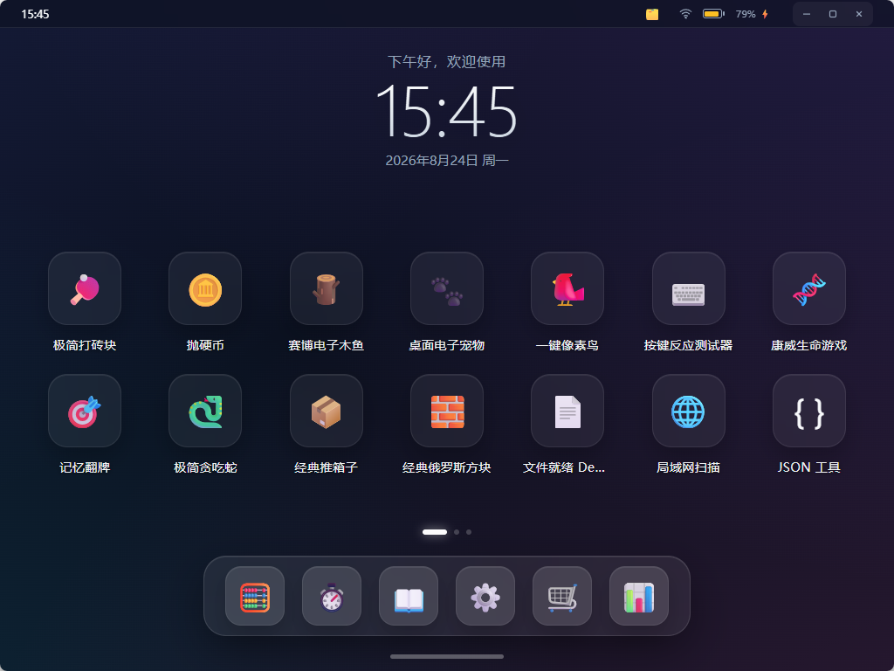

# Web Launcher 项目说明书

> 离线版项目文档｜当前 launcher 版本：1.0.5
> 左侧目录树可展开，点下方各章标题即可阅读。

## 这是什么

Web Launcher 是一个基于 **Python 标准库** 的轻量级多语言应用运行时，适合 Windows、Linux、macOS 与 ARM 嵌入式设备。

它负责启动、管理与更新各类应用（Python / C/C++ / Web / 前后端分离页面等），并自带：

- 仿移动端的桌面界面（分页桌面 / Dock / 最近任务）
- 应用商店（安装、升级、卸载）
- 版本仓库（HTTP 静态目录 + `index.json`）
- launcher 自身 OTA 更新

核心价值：**用最小依赖 + 一个 `app.json` 协议，即可对任意语言的应用做部署、增删、升级。**

## 相关仓库

- [GitHub：web-launcher](https://github.com/Jun1172/web-launcher)
- [Gitee：web-launcher](https://gitee.com/jun626/web-launcher)
- [GitHub：web-launcher-apps](https://github.com/Jun1172/web-launcher-apps)

`web-launcher` 提供运行时、界面、商店与发布工具；`web-launcher-apps` 提供公开的游戏、通用工具、ROS2 工具及示例应用。

## 界面速览

## 目录导航

| 章节 | 内容 |
|------|------|
| [01-快速开始](01-快速开始.md) | 环境要求、启动方法、首个应用 |
| [02-项目架构](02-项目架构.md) | 设计定位、目录结构、三层模型、运行流程 |
| [03-应用接入](03-应用接入.md) | `app.json` 字段、应用分类与分组、多语言启动 |
| [04-进程管理](04-进程管理.md) | 进程启动、端口就绪探测、优雅停止、进程树清理 |
| [05-发布与仓库](05-发布与仓库.md) | `tools/publish.py` 用法、远端仓库结构、`index.json` |
| [06-HTTP-API](06-HTTP-API.md) | 内置 HTTP 路由表与 `running` 字段说明 |
| [07-自更新与部署](07-自更新与部署.md) | launcher OTA、安全注意事项、嵌入式部署 |
| [08-界面与交互](08-界面与交互.md) | 桌面 UI、状态栏、Dock、手势、布局编辑 |

> 完整说明以项目仓库根目录 [README.md](https://github.com/Jun1172/web-launcher#readme) 为准，本文是离线精简版。