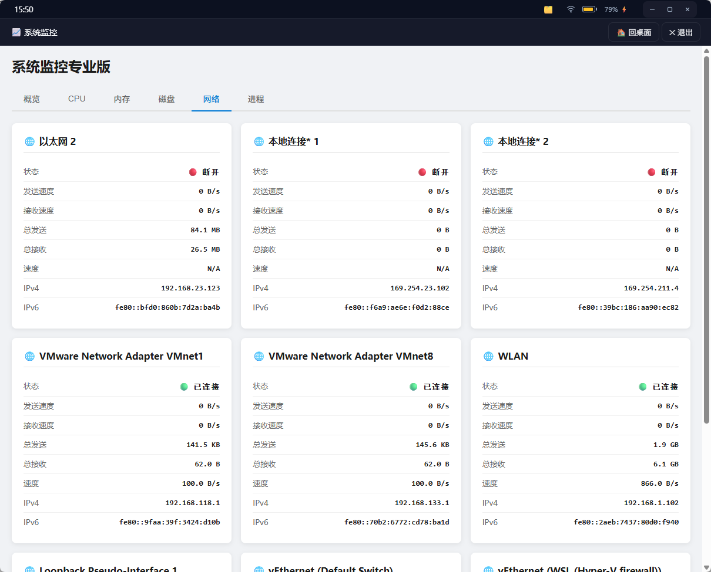
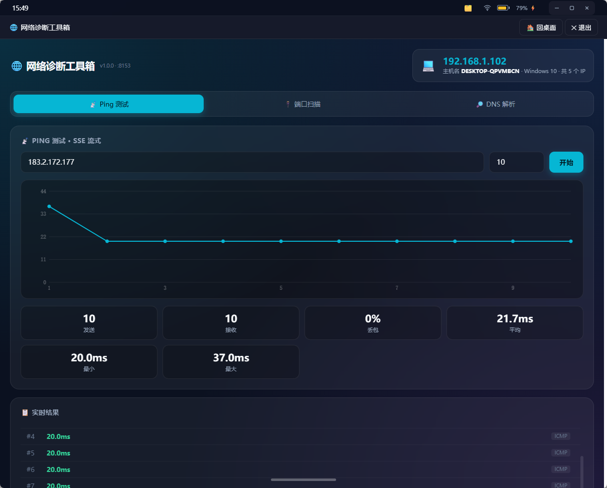

# Web Launcher 项目说明书

> 离线版项目文档｜当前 launcher 版本：1.0.5

## 项目简介

Web Launcher 是一个基于 Python 标准库的轻量级多语言应用运行时，适合 Windows、Linux、macOS 和 ARM 设备。它可以启动和管理 Python、C/C++、Web 等应用，并提供桌面界面、应用商店、安装升级、版本回退和 launcher 自更新能力。

公开仓库：

- [GitHub：web-launcher](https://github.com/Jun1172/web-launcher)
- [Gitee：web-launcher](https://gitee.com/jun626/web-launcher)
- [GitHub：web-launcher-apps](https://github.com/Jun1172/web-launcher-apps)

## 快速开始

需要 Python 3.8 或更高版本，无第三方依赖即可运行：

```bash
python launcher.py
```

启动后打开 `http://127.0.0.1:8000/`。如果安装了桌面窗口依赖，launcher 也可以使用桌面窗口模式；否则使用浏览器访问。

## 核心组成

| 组件 | 作用 |
|------|------|
| `launcher.py` | 启动入口 |
| `launcher/` | 配置、应用注册、进程管理、HTTP 路由和更新功能 |
| `apps/` | 内置应用和本地接入的应用 |
| `config.json` | launcher、仓库和发布配置 |
| `publish.py` | 打包并发布应用或 launcher 更新 |

## 界面概览

### 桌面与应用入口

launcher 提供分页桌面、Dock 栏和应用图标入口，系统应用与用户应用可以统一管理。


### 系统信息

系统信息页面集中展示 CPU、内存、磁盘、运行环境和已安装应用状态。


### 系统监控

系统监控应用提供 CPU、内存、磁盘、网络和进程等运行状态查看能力。



### 网络工具

网络诊断工具支持 Ping 测试、端口扫描和 DNS 解析，适合设备现场排查网络问题。



## 应用接入

每个应用目录至少包含一个 `app.json`，清单示例：

```json
{
  "id": "my-app",
  "name": "我的应用",
  "version": "1.0.0",
  "cmd": ["apps/user/my-app/app.py"],
  "port": 8120,
  "group": "user"
}
```

`cmd` 定义启动命令，Python 文件会自动使用当前 Python 解释器；填写 `port` 后 launcher 会等待端口监听，无端口的后台进程启动后即视为就绪。

## 应用分类

- `system`：系统应用，默认安装、可更新、不可卸载。
- `user`：用户应用，可通过应用商店安装和卸载。
- 自定义分组：通过 `group` 字段划分工具集合。

外部应用仓库可按组将目录复制或软链到 launcher 的 `apps/` 下。接入时避免覆盖系统目录，也不要同时放入相同 `id` 的多个应用。

## 发布应用

```bash
python publish.py --list
python publish.py apps/user/my-app --dry-run
python publish.py apps/user/my-app
python publish.py --all
```

launcher 自身更新使用：

```bash
python publish.py --launcher --changelog "更新说明"
```

发布工具会生成应用 zip、计算 SHA-256，并更新远端 `index.json`。应用仓库和 launcher 仓库都提供发布脚本，但 launcher 自更新应使用 launcher 仓库中的脚本。

## 配置与安全

- 默认只监听 `127.0.0.1`，如需远程访问应增加反向代理和鉴权。
- 仓库可以配置 HTTPS、BASIC 认证和 SSL 校验选项。
- `env` 等敏感配置不会写入远端应用索引。
- C/C++ 应用需要针对目标操作系统和 CPU 架构分别编译。

## 文档目录

本应用会递归展示 `docs/` 下的 `.md` 和 `.markdown` 文件。可以按主题增加子目录，也可以在 Markdown 中引用 `docs/images/` 下的本地图片。所有文档和渲染代码都内置在应用中，断网时仍可阅读。

更多字段和 API 说明请查看项目仓库中的 [README.md](https://github.com/Jun1172/web-launcher#readme) 与 `apps/README.md`。
